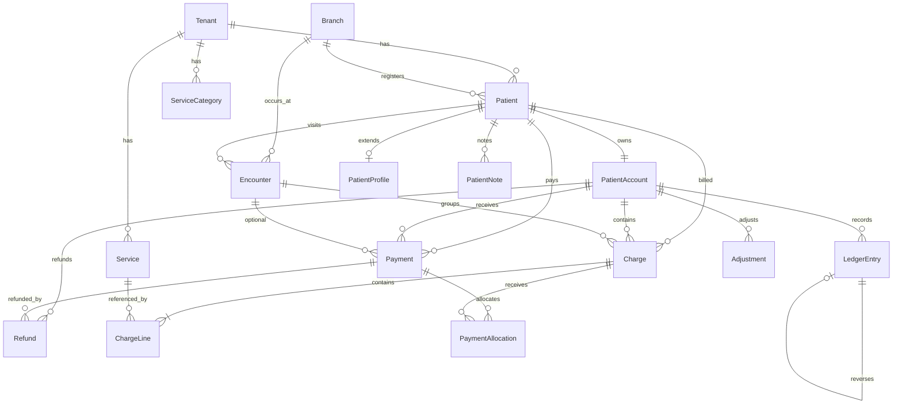

# PMS Domain Design — Patient Management & Accounting System

**Phase:** 1a (Schema migrated — no UI)  
**Status:** Approved — Phase 1a complete  
**Date:** 2026-09-07  
**Architecture:** Electron (thin client) → NestJS → PostgreSQL → LAN  

---

## Table of Contents

1. [Product / Domain Overview](#1-product--domain-overview)
2. [Domain Entities](#2-domain-entities)
3. [Entity Relationships](#3-entity-relationships)
4. [Financial Ledger Design](#4-financial-ledger-design)
5. [Charge / Payment / Refund Lifecycle](#5-charge--payment--refund-lifecycle)
6. [Encounter Decision](#6-encounter-decision)
7. [Tenant Isolation](#7-tenant-isolation)
8. [RBAC Mapping](#8-rbac-mapping)
9. [Audit Strategy](#9-audit-strategy)
10. [Money & Rounding Strategy](#10-money--rounding-strategy)
11. [Timestamp Strategy](#11-timestamp-strategy)
12. [Database Schema Proposal](#12-database-schema-proposal)
13. [NestJS Module Structure](#13-nestjs-module-structure)
14. [API Boundary Proposal](#14-api-boundary-proposal)
15. [Migration Strategy](#15-migration-strategy)
16. [Risks & Trade-offs](#16-risks--trade-offs)
17. [Recommended Implementation Order](#17-recommended-implementation-order)

---

## 1. Product / Domain Overview

### Purpose

Fratelanza PMS is a **commercial-grade Patient Management & Accounting System** for clinics operating on a LAN with a central PostgreSQL server. It manages:

- Patient registration and administrative records
- Clinic service catalog and pricing
- Patient financial accounts (charges, payments, discounts, refunds, adjustments)
- Visit/encounter grouping for services rendered
- Auditability, permissions, and multi-clinic (tenant) isolation

### What this is NOT

| Not in scope (Phase 1 design) | Reason |
|--------------------------------|--------|
| Full EMR / clinical documentation | PMS + accounting first |
| Renamed ERP entities (Customer → Patient, Product → Service) | Incorrect domain modeling |
| Offline sync / client SQLite | Phase 0 LAN MVP decision |
| Insurance claims / payer integration | Future phase |
| Inventory / POS / purchasing | Frozen ERP domain |

### Domain separation

```
┌─────────────────────────────────────────────────────────────┐
│                     SHARED PLATFORM                         │
│  Tenant · Branch · User · Role · Permission · Session       │
│  AuditLog · NumberSequence · DocumentNumberService          │
└─────────────────────────────────────────────────────────────┘
         │                                    │
         ▼                                    ▼
┌─────────────────────┐          ┌─────────────────────────┐
│   LEGACY ERP        │          │   PMS DOMAIN (NEW)      │
│   (frozen)          │          │   (Phase 1+)            │
│                     │          │                         │
│ Customer            │   ≠      │ Patient                 │
│ Product             │   ≠      │ Service                 │
│ SalesInvoice        │   ≠      │ Charge                  │
│ CustomerPayment     │   ≠      │ Payment                 │
│ Account/JournalEntry│   ≠      │ PatientAccount/Ledger   │
└─────────────────────┘          └─────────────────────────┘
```

ERP and PMS may coexist in the same database and share **infrastructure**, but they must **never share business entities**.

---

## 2. Domain Entities

### 2.1 Patient

A **Patient** is a first-class domain entity representing a person receiving clinic services. It is not a renamed Customer.

| Field | Type | Purpose | Mutable after create |
|-------|------|---------|----------------------|
| `id` | UUID | Internal primary key | No |
| `tenantId` | UUID | Clinic isolation | No |
| `branchId` | UUID? | Registration branch (optional) | Yes (transfer) |
| `code` | String | Human-readable patient ID (e.g. `PAT-2026-000042`) | No |
| `firstName` | String | Given name | Yes |
| `lastName` | String | Family name | Yes |
| `fullName` | String | Denormalized display name (computed/stored) | Yes |
| `phone` | String? | Primary contact | Yes |
| `email` | String? | Contact email | Yes |
| `address` | String? | Administrative address | Yes |
| `dateOfBirth` | Date? | DOB (date only, no time) | Yes (with audit) |
| `gender` | Enum? | `male`, `female`, `other`, `unknown` | Yes |
| `status` | Enum | `active`, `inactive`, `deceased` | Yes |
| `registeredAt` | DateTime | First registration timestamp (server) | No |
| `notes` | String? | Short administrative note (not clinical chart) | Yes |
| `createdById` | UUID? | Registering user | No |
| `updatedById` | UUID? | Last editor | Yes |
| `createdAt` | DateTime | Server timestamp | No |
| `updatedAt` | DateTime | Server timestamp | Auto |
| `deletedAt` | DateTime? | Soft delete | Yes |

**Deliberately excluded** (no clear business purpose in MVP): national ID number, blood type, allergies, insurance member ID, photo, marital status, emergency contacts as structured fields. These can be added later via `PatientProfile` extension without polluting the core entity.

**Patient code (`code`)** is assigned via the existing atomic `DocumentNumberService` using document type `PAT`, prefix `PAT`. It is separate from the internal UUID. Phase 1c uses the patient's `branchId` when supplied, otherwise the tenant's default branch, as the `number_sequences.branchId` key — **not** `NULL branchId` (PostgreSQL unique-index semantics treat NULL as distinct, breaking atomic upsert).

---

### 2.2 PatientProfile (optional extension, 1:1)

Extended administrative profile data that may grow over time without bloating the core Patient table.

| Field | Purpose |
|-------|---------|
| `patientId` | FK → Patient (unique) |
| `preferredLocale` | `ar`, `en`, etc. |
| `referralSource` | How patient found clinic |
| `emergencyContactName` | Optional |
| `emergencyContactPhone` | Optional |
| `metadata` | JSON for clinic-specific optional fields |

One profile per patient. Core Patient holds identity/contact; profile holds optional extensions.

---

### 2.3 PatientAccount

Each patient has **exactly one financial account per tenant**. This is the anchor for all ledger entries.

| Field | Purpose |
|-------|---------|
| `id` | UUID PK |
| `tenantId` | Clinic isolation |
| `patientId` | FK → Patient (unique per tenant) |
| `cachedBalance` | Denormalized running balance (`Decimal`) |
| `balanceAsOf` | Timestamp of last balance reconciliation |
| `currency` | ISO code copied from tenant settings at creation |
| `status` | `open`, `closed`, `on_hold` |
| `openedAt` | Account open date |
| `createdAt`, `updatedAt` | Metadata |

**Source of truth:** `LedgerEntry` sum, not `cachedBalance`.  
**Cached balance:** Performance optimization only; updated atomically inside the same database transaction as every ledger write.

---

### 2.4 Service (catalog)

A **Service** is a billable clinic offering. It is **not** a Product.

| Field | Purpose | Mutable |
|-------|---------|---------|
| `id` | UUID PK | No |
| `tenantId` | Clinic isolation | No |
| `code` | Short code (e.g. `CONS-30`) | Yes (does not affect history) |
| `name` | Display name | Yes |
| `categoryId` | FK → ServiceCategory | Yes |
| `description` | Optional text | Yes |
| `defaultPrice` | Current catalog price | Yes |
| `department` | Optional string (e.g. Dermatology) | Yes |
| `durationMinutes` | Optional estimated duration | Yes |
| `isActive` | Catalog visibility | Yes |
| `createdById`, `updatedById` | Audit metadata | Partial |
| `createdAt`, `updatedAt`, `deletedAt` | Timestamps / soft delete | Partial |

**Historical pricing rule:** When a charge is created, the service's `code`, `name`, and `unitPrice` are **copied into the charge line snapshot**. Changing `Service.defaultPrice` later must never alter posted charges.

---

### 2.5 ServiceCategory

Grouping for services (e.g. Consultation, Lab, Procedure). Tenant-scoped, soft-deletable.

---

### 2.6 Encounter (Visit)

Lightweight visit container — **not** an EMR encounter.

| Field | Purpose |
|-------|---------|
| `id` | UUID PK |
| `tenantId`, `branchId` | Isolation + location |
| `patientId` | FK → Patient |
| `number` | Document number (`ENC-2026-000001`) |
| `encounterDate` | Visit date (date; time optional separate field) |
| `startedAt`, `endedAt` | Optional timestamps |
| `status` | `scheduled`, `in_progress`, `completed`, `cancelled`, `no_show` |
| `providerId` | Optional FK → User (doctor/staff) |
| `department` | Optional string |
| `notes` | Administrative visit notes |
| `createdById`, `updatedById` | Audit |
| `createdAt`, `updatedAt`, `deletedAt` | Timestamps |

Encounters group charges for a single visit. Payments may optionally reference an encounter but are primarily patient-account scoped.

---

### 2.7 Charge

A **Charge** represents an amount owed by the patient. It is independent from ERP `SalesInvoice`.

| Field | Purpose |
|-------|---------|
| `id`, `tenantId`, `branchId` | Identity + scope |
| `patientId` | FK → Patient |
| `accountId` | FK → PatientAccount |
| `encounterId` | Optional FK → Encounter |
| `number` | Document number (`CHG-2026-000001`) |
| `status` | `draft`, `posted`, `partially_paid`, `paid`, `voided` |
| `chargeDate` | Business date of charge |
| `subtotal` | Sum of lines before discounts |
| `discountTotal` | Total discounts applied |
| `total` | Final amount owed from this charge |
| `paidAmount` | Amount applied via payments |
| `notes` | Optional |
| `postedAt`, `postedById` | Posting metadata |
| `voidedAt`, `voidedById`, `voidReason` | Void metadata |
| `createdById`, `createdAt`, `updatedAt` | Audit |

**Immutable after posting:** line snapshots, amounts, service references. Corrections via void/reversal, not in-place edits.

---

### 2.8 ChargeLine

Line items within a charge. Each line preserves a **service snapshot**.

| Field | Purpose |
|-------|---------|
| `id`, `chargeId` | Identity |
| `serviceId` | FK → Service (reference only; may be null if service deleted) |
| `serviceCode` | **Snapshot** at charge time |
| `serviceName` | **Snapshot** at charge time |
| `description` | Optional override description |
| `quantity` | Decimal (typically 1) |
| `unitPrice` | **Snapshot** price used |
| `lineSubtotal` | `quantity × unitPrice` |
| `discountAmount` | Fixed discount on this line |
| `discountPercent` | Percentage discount on this line (applied before fixed) |
| `lineTotal` | Final line amount after discounts |
| `sortOrder` | Display order |

---

### 2.9 Payment

A **Payment** is money received from the patient. First-class financial transaction.

| Field | Purpose |
|-------|---------|
| `id`, `tenantId`, `branchId` | Identity + scope |
| `patientId` | FK → Patient |
| `accountId` | FK → PatientAccount |
| `encounterId` | Optional FK → Encounter |
| `number` | Receipt number (`PMT-2026-000001`) |
| `amount` | Payment amount (positive) |
| `method` | Enum: `cash`, `card`, `bank_transfer`, `other` |
| `reference` | External reference (card auth, transfer ref) |
| `notes` | Optional |
| `paymentDate` | Business date |
| `status` | `posted`, `voided`, `refunded`, `partially_refunded` |
| `idempotencyKey` | Unique per tenant — duplicate prevention |
| `postedAt`, `postedById` | Posting metadata |
| `createdAt`, `updatedAt` | Audit |

**No destructive edits** after posting. Void/refund creates linked reversal records.

---

### 2.10 PaymentAllocation

Links payments to specific charges (optional but recommended for allocation tracking).

| Field | Purpose |
|-------|---------|
| `paymentId` | FK → Payment |
| `chargeId` | FK → Charge |
| `amount` | Portion of payment applied to this charge |

Enables "pay invoice X" semantics. Unallocated payments reduce account balance globally.

---

### 2.11 Refund

Represents money returned to the patient. Never deletes the original payment.

| Field | Purpose |
|-------|---------|
| `id`, `tenantId`, `branchId` | Identity |
| `patientId`, `accountId` | Scope |
| `paymentId` | FK → original Payment |
| `number` | `REF-2026-000001` |
| `amount` | Refund amount (positive) |
| `reason` | Required text |
| `method` | How refund was issued |
| `status` | `posted`, `voided` |
| `refundDate` | Business date |
| `postedAt`, `postedById` | Metadata |
| `createdAt` | Audit |

Constraint: sum of refunds for a payment ≤ original payment amount.

---

### 2.12 Adjustment

Manual balance correction with mandatory reason. Used for opening balances, write-offs, and exceptional corrections.

| Field | Purpose |
|-------|---------|
| `id`, `tenantId`, `branchId` | Identity |
| `patientId`, `accountId` | Scope |
| `number` | `ADJ-2026-000001` |
| `adjustmentType` | `opening_balance`, `credit`, `debit`, `write_off` |
| `amount` | Positive amount |
| `direction` | `increase_balance` or `decrease_balance` |
| `reason` | Required |
| `status` | `posted`, `voided` |
| `adjustmentDate` | Business date |
| `approvedById` | Optional — for exceptional adjustments |
| `postedAt`, `postedById` | Metadata |

---

### 2.13 LedgerEntry

**Source of truth** for patient financial state.

| Field | Purpose |
|-------|---------|
| `id` | UUID PK |
| `tenantId` | Clinic isolation |
| `accountId` | FK → PatientAccount |
| `entryType` | See enum below |
| `direction` | `debit` (increases balance owed) or `credit` (decreases) |
| `amount` | Always positive; sign semantics via direction |
| `currency` | Copied from account |
| `entryDate` | Business date |
| `postedAt` | Server timestamp |
| `referenceType` | `charge`, `payment`, `refund`, `adjustment`, `discount`, `reversal` |
| `referenceId` | UUID of source document |
| `reversalOfId` | Optional FK → LedgerEntry being reversed |
| `description` | Human-readable summary |
| `runningBalance` | Balance after this entry (denormalized audit trail) |
| `createdById` | User who caused the entry |
| `createdAt` | Immutable |

**Entry types (`entryType`):**

| Type | Direction | Meaning |
|------|-----------|---------|
| `opening_balance` | debit or credit | Initial account state |
| `charge` | debit | Patient owes more |
| `discount` | credit | Reduces amount owed |
| `payment` | credit | Patient paid |
| `refund` | debit | Money returned (increases balance owed again) |
| `adjustment` | debit or credit | Manual correction |
| `reversal` | opposite of original | Cancels a prior entry |

**Ledger entries are append-only.** No updates or deletes. Corrections append reversal entries.

---

### 2.14 PatientNote (timeline)

Administrative notes attached to a patient, separate from the single `Patient.notes` field.

| Field | Purpose |
|-------|---------|
| `patientId` | FK → Patient |
| `content` | Note text |
| `noteType` | `general`, `billing`, `administrative` |
| `createdById`, `createdAt` | Audit |
| `deletedAt` | Soft delete |

Supports Patient 360° activity timeline without mixing into financial tables.

---

## 3. Entity Relationships

### 3.1 ER diagram (conceptual)



### 3.2 Patient 360° read model

The Patient 360° view is a **composed read model**, not a single table. It aggregates:

| Section | Source entities |
|---------|-----------------|
| Patient information | `Patient`, `PatientProfile` |
| Current balance | `PatientAccount.cachedBalance` (derived from `LedgerEntry`) |
| Financial history | `LedgerEntry` ordered by `postedAt` |
| Services rendered | `ChargeLine` snapshots across `Charge` |
| Open charges | `Charge` where status in (`posted`, `partially_paid`) |
| Payments | `Payment` |
| Discounts | `ChargeLine.discount*` + ledger `discount` entries |
| Refunds | `Refund` |
| Adjustments | `Adjustment` |
| Visits | `Encounter` |
| Notes | `PatientNote` + `Patient.notes` |
| Activity / audit | `AuditLog` filtered by `entity` in PMS entities |

Future API: `GET /api/v1/pms/patients/:id/360` returns this aggregate (read-only, Phase 2+ implementation).

---

## 4. Financial Ledger Design

### 4.1 Core principle

> **The ledger is the source of truth. The cached balance is a performance cache.**

```
Patient ──1:1──► PatientAccount ──1:N──► LedgerEntry (append-only)
                         │
                         └── cachedBalance (updated in same TX as each entry)
```

### 4.2 Balance semantics

**Balance = total amount the patient owes the clinic** (patient accounts receivable).

| Event | Ledger direction | Effect on balance |
|-------|------------------|-------------------|
| Charge posted | debit | Balance increases |
| Line/header discount | credit | Balance decreases |
| Payment posted | credit | Balance decreases |
| Refund posted | debit | Balance increases |
| Credit adjustment (write-off) | credit | Balance decreases |
| Debit adjustment (add debt) | debit | Balance increases |
| Reversal of any above | opposite | Undoes original |

### 4.3 Posting flow (atomic transaction)

Every financial mutation follows this pattern inside a single Prisma `$transaction`:

1. Validate amount (positive `Decimal`) before any transactional query
2. Validate tenant scope, permissions, and business invariants
3. Lock `PatientAccount` row (`SELECT … FOR UPDATE`)
4. Create/update the business document (Charge, Payment, etc.) — Phase 1c+
5. Append one or more `LedgerEntry` rows via `LedgerPostingService.postEntry(input, tx)`
6. Update `PatientAccount.cachedBalance` and `balanceAsOf` **inside the same `postEntry` call and transaction**
7. Write `AuditLog`
8. Commit

> **Critical rule (approved):** `cachedBalance` must **NEVER** be updated independently. Every financial operation must update `LedgerEntry`, `PatientAccount.cachedBalance`, and related financial records inside the **same database transaction**. The ledger remains the authoritative source of truth.

> **Phase 1b implementation:** `LedgerPostingService.postEntry()` requires a caller-supplied `tx` and never opens nested transactions. `PatientAccountService.reconcileBalance()` compares cached vs ledger-derived totals for future reconciliation jobs.

**Concurrency:** `PatientAccountService.lockAccountForUpdate()` uses PostgreSQL `FOR UPDATE` at the start of each `postEntry` call.

### 4.4 Balance reconciliation (future capability)

A reconciliation job (Phase 1b+) will verify:

```
cachedBalance === SUM(debit amounts) − SUM(credit amounts)  (per account)
```

On mismatch: log alert, expose admin diagnostic endpoint, optionally block new postings until resolved. This is a safety net — not the primary balance path.

### 4.5 Discount ledger representation

Discounts reduce the patient's obligation. Two valid approaches — **chosen approach: hybrid**:

- **Charge line math:** Discounts applied when calculating `ChargeLine.lineTotal` and `Charge.total`
- **Ledger:** Single `charge` debit entry for **net total after discounts** (simpler ledger)
- **Optional separate `discount` credit entries** when audit requires discount visibility as distinct line items (configurable per tenant via settings)

Default MVP: one `charge` debit entry for the net `Charge.total`. Discount breakdown preserved on `ChargeLine` snapshots and in `AuditLog`.

---

## 5. Charge / Payment / Refund Lifecycle

### 5.1 Charge lifecycle

```
draft ──post──► posted ──payments──► partially_paid ──fully paid──► paid
  │                │
  │                └── void ──► voided (+ reversal ledger entries)
  └── delete (draft only)
```

| Transition | Rules |
|------------|-------|
| Create draft | Requires `pms:charges:create`; no ledger impact |
| Post charge | Requires `pms:ledger:charge`; creates ledger debit; assigns number if not assigned |
| Apply payment | Updates `Charge.paidAmount`; may change status to `partially_paid` / `paid` |
| Void posted charge | Requires `pms:ledger:void`; only if no payments allocated OR payments reversed first; creates reversal entries |

### 5.2 Payment lifecycle

```
create (with idempotencyKey) ──post──► posted
                                         │
                    ┌────────────────────┼────────────────────┐
                    ▼                    ▼                    ▼
                 voided            partially_refunded       refunded
              (+ reversal)         (+ Refund records)    (+ Refund records)
```

| Rule | Detail |
|------|--------|
| Duplicate prevention | Unique `(tenantId, idempotencyKey)` on Payment |
| Allocation | Optional `PaymentAllocation` rows link payment to charges |
| Overpayment | Allowed — reduces balance below zero only if tenant setting permits credit balance |
| Void | Creates reversal ledger entry; original payment row marked `voided`, never deleted |

### 5.3 Refund lifecycle

```
Payment (posted) ──refund──► Refund (posted) ──► Payment status updated
```

| Rule | Detail |
|------|--------|
| Max refund | Sum(refunds) ≤ payment.amount − sum prior refunds |
| Partial refund | Supported; payment → `partially_refunded` |
| Full refund | Payment → `refunded` |
| Ledger | Refund creates debit entry (patient owes more again) |

### 5.4 Adjustment lifecycle

Adjustments require `pms:ledger:adjust`. Amounts above a configurable threshold require `pms:ledger:adjust:approve` (future workflow; permission exists in design now).

---

## 6. Encounter Decision

### Decision: **Include lightweight Encounter model**

**Justification:**

| Requirement | Supported by Encounter |
|-------------|------------------------|
| Multiple visits per patient | Yes |
| Group services/charges by visit | Yes |
| Doctor/staff association | Optional `providerId` |
| Department | Optional field |
| Visit status tracking | Yes |
| Future scheduling hooks | Status `scheduled` |

**What Encounter is NOT:**

- Clinical diagnosis / ICD codes
- Prescriptions / lab orders
- Medical imaging
- Nursing notes / vitals

**Relationship chain (target architecture):**

```
Patient → Encounter → Charge(s) → ChargeLine(s) → Service snapshot
                                ↘ Payment(s) (optional encounter link)
```

Encounters are **optional** on charges — walk-in charges without a formal visit remain valid.

---

## 7. Tenant Isolation

### 7.1 Rules

1. **Every PMS table includes `tenantId`** (required, indexed).
2. **All service-layer queries filter by `tenantId`** from JWT — never from request body alone.
3. **Composite foreign keys** where feasible: e.g. `(tenantId, patientId)` on child tables to prevent cross-tenant FK references at DB level.
4. **Branch scoping** is secondary: `branchId` on transactions for reporting, not for security boundary (tenant is the security boundary).
5. **No shared patients across tenants** — a person registered at Clinic A is a different record from Clinic B.

### 7.2 Enforcement layers

| Layer | Mechanism |
|-------|-----------|
| API | `@TenantId()` from JWT; reject if missing |
| Service | Every `findFirst`/`findMany` includes `where: { tenantId }` |
| Database | FK constraints + composite uniques including `tenantId` |
| Tests | Integration tests attempt cross-tenant access → expect 404/403 |

### 7.3 Branch architecture (approved MVP decision)

**One `PatientAccount` per Patient per Tenant** — no separate accounts per branch in MVP.

**Branch-aware transactions from day one:**

| Model | `branchId` | Purpose |
|-------|------------|---------|
| `Patient` | Optional | Registration branch |
| `Encounter` | Required | Visit location |
| `Charge` | Required | Where charge was created |
| `Payment` | Required | Where payment was collected |
| `Refund` | Required | Where refund was issued |
| `Adjustment` | Required | Where adjustment was recorded |
| `LedgerEntry` | Required | Branch attribution for reporting |
| `PatientAccount` | **None** | Consolidated tenant-level balance |

```
Tenant
├── Branch A ──► transactions tagged branchId = A
├── Branch B ──► transactions tagged branchId = B
└── Patient ──► ONE PatientAccount (tenant-level balance)
```

This supports future branch-level reporting and analytics without implementing multi-branch account splitting in MVP. Schema indexes include `(tenantId, branchId)` on transactional tables to enable branch reports later.

### 7.4 Existing infrastructure reuse

- `Tenant`, `Branch`, `User` models unchanged
- `JwtPayload.tenantId` unchanged
- Same `@TenantId()` decorator pattern as ERP controllers

---

## 8. RBAC Mapping

Permissions follow existing format: `module:feature:action` via global `Permission` table + tenant `Role` assignments.

### 8.1 PMS permission catalog (proposed)

| Permission key | Description |
|----------------|-------------|
| **Patients** | |
| `pms:patients:read` | View patient list and details |
| `pms:patients:create` | Register new patients |
| `pms:patients:update` | Edit patient demographics |
| `pms:patients:delete` | Soft-delete patients |
| `pms:patients:notes` | Add/view patient notes |
| **Services** | |
| `pms:services:read` | View service catalog |
| `pms:services:create` | Create services |
| `pms:services:update` | Edit services / pricing |
| `pms:services:delete` | Deactivate/delete services |
| **Encounters** | |
| `pms:encounters:read` | View visits |
| `pms:encounters:create` | Create visits |
| `pms:encounters:update` | Update visit status/details |
| `pms:encounters:cancel` | Cancel visits |
| **Charges** | |
| `pms:charges:read` | View charges |
| `pms:charges:create` | Create draft charges |
| `pms:charges:update` | Edit draft charges |
| `pms:charges:post` | Post charges to ledger |
| `pms:charges:void` | Void posted charges |
| **Ledger** | |
| `pms:ledger:read` | View ledger entries and balance |
| `pms:ledger:payment` | Record payments |
| `pms:ledger:refund` | Issue refunds |
| `pms:ledger:adjust` | Post adjustments |
| `pms:ledger:adjust:approve` | Approve high-value adjustments |
| **Discounts** | |
| `pms:discounts:apply` | Apply discounts within role limits |
| `pms:discounts:override` | Exceed normal discount limits |
| `pms:discounts:approve` | Approve exceptional discounts |
| **Reports** | |
| `pms:reports:read` | View PMS financial reports |
| `pms:reports:export` | Export reports |
| **Settings** | |
| `pms:settings:read` | View PMS clinic settings |
| `pms:settings:update` | Update PMS settings (discount limits, etc.) |

### 8.2 Discount limits (settings-driven, not role-name hardcoding)

Store per-role or per-tenant limits in `Tenant.settings` or a future `PmsRoleLimit` table:

```json
{
  "pms": {
    "maxDiscountPercent": 10,
    "maxDiscountAmount": 500,
    "requireApprovalAbovePercent": 20
  }
}
```

Business logic checks permissions first, then numeric limits, then approval workflow.

### 8.3 Seed strategy

Add PMS permissions to `CORE_PERMISSIONS` in seed. Assign all to `owner` role. ERP permissions remain unchanged.

Add `TenantModule` entry: `moduleId: 'pms'`, `isEnabled: true` for demo tenant.

---

## 9. Audit Strategy

### 9.1 Events requiring audit records

| Entity | Actions audited |
|--------|-----------------|
| `patient` | create, update, delete, status_change |
| `patient_note` | create, delete |
| `service` | create, update, delete, price_change |
| `encounter` | create, update, cancel, complete |
| `charge` | create, update, post, void |
| `payment` | create, post, void |
| `refund` | create, post |
| `adjustment` | create, post, approve |
| `discount` | apply, override, approve |
| `ledger_entry` | post, reverse (via parent document audit) |

Use existing `AuditService.log()` with:

```typescript
{
  tenantId,
  branchId,
  userId,
  entity: 'patient' | 'charge' | 'payment' | ...,
  entityId: uuid,
  action: 'create' | 'post' | 'void' | ...,
  oldValue?: json,  // sanitized
  newValue?: json,  // sanitized
}
```

### 9.2 PHI / privacy in logs

| Do log | Do NOT log |
|--------|------------|
| Entity IDs, action types, amounts | Full patient notes in error logs |
| Changed field names | Passwords, tokens |
| User ID who performed action | Unnecessary DOB/phone in `oldValue`/`newValue` unless field changed |
| Timestamps | Full patient record dumps |

For patient updates, log `{ "field": "phone", "changed": true }` rather than old/new phone values in production audit unless compliance requires it (configurable).

---

## 10. Money & Rounding Strategy

### 10.1 Storage type

| Use | PostgreSQL | Prisma |
|-----|------------|--------|
| All monetary amounts | `DECIMAL(18,4)` | `@db.Decimal(18, 4)` |
| Percentages (discounts, tax) | `DECIMAL(8,4)` | `@db.Decimal(8, 4)` |
| Quantities (service units) | `DECIMAL(18,4)` | `@db.Decimal(18, 4)` |

**Never use `Float`, `Double`, or JavaScript `number` for persisted money.**

### 10.2 Currency

- Source: `Tenant.settings.defaultCurrency` (seed default: `EGP`)
- Stored on `PatientAccount.currency` at account creation
- MVP: single currency per tenant; multi-currency deferred

### 10.3 Calculation rules

1. Line subtotal = `quantity × unitPrice` (Decimal math via `Prisma.Decimal` or `decimal.js`)
2. Line discount: apply `discountPercent` first, then subtract `discountAmount`
3. Line total = line subtotal − line discounts
4. Charge subtotal = sum of line subtotals before discounts
5. Charge total = sum of line totals (after line discounts) − header discount if any
6. **Round to 4 decimal places** at each line total, then sum (consistent with ERP)
7. Display: format to 2 decimal places in UI (rounding for display only)

### 10.4 Rounding policy

| Step | Policy |
|------|--------|
| Intermediate calculations | Full 4 decimal precision |
| Stored amounts | `Decimal(18,4)` |
| Display | Banker's rounding to 2 decimals (HALF_EVEN) — configurable in tenant settings |
| Ledger entries | Exact stored amounts, no display rounding |

---

## 11. Timestamp Strategy

### 11.1 Rules

| Timestamp type | Source | Storage |
|----------------|--------|---------|
| `createdAt`, `updatedAt`, `postedAt` | **Server** (NestJS/PostgreSQL `now()`) | `TIMESTAMPTZ` (UTC) |
| Business dates (`chargeDate`, `paymentDate`, `encounterDate`) | User input, validated server-side | `DATE` or `TIMESTAMPTZ` |
| `dateOfBirth` | User input | `DATE` (no timezone) |

### 11.2 Prohibited

- Trusting client/Electron clock for `postedAt` or audit timestamps
- Mixing local PC time into financial posting timestamps
- Storing timezone-naive timestamps for event ordering

### 11.3 Display

- Convert UTC → tenant timezone (`Tenant.settings.timezone`, default `Africa/Cairo`) in API responses or frontend
- API may include `displayTimezone` in settings response

---

## 12. Database Schema Proposal

### 12.1 New enums

```prisma
enum PatientStatus { active inactive deceased }
enum PatientGender { male female other unknown }
enum EncounterStatus { scheduled in_progress completed cancelled no_show }
enum ChargeStatus { draft posted partially_paid paid voided }
enum PaymentStatus { posted voided refunded partially_refunded }
enum PaymentMethod { cash card bank_transfer other }
enum RefundStatus { posted voided }
enum AdjustmentStatus { posted voided }
enum AdjustmentDirection { increase_balance decrease_balance }
enum LedgerEntryType { opening_balance charge discount payment refund adjustment reversal }
enum LedgerDirection { debit credit }
enum PatientAccountStatus { open closed on_hold }
```

### 12.2 Model summary

| Model | Table | Purpose | Soft delete |
|-------|-------|---------|-------------|
| `Patient` | `pms_patients` | Core patient identity | Yes |
| `PatientProfile` | `pms_patient_profiles` | Extended profile (1:1) | No |
| `PatientNote` | `pms_patient_notes` | Note timeline | Yes |
| `PatientAccount` | `pms_patient_accounts` | Financial account anchor | No |
| `ServiceCategory` | `pms_service_categories` | Service grouping | Yes |
| `Service` | `pms_services` | Service catalog | Yes |
| `Encounter` | `pms_encounters` | Visit container | Yes |
| `Charge` | `pms_charges` | Patient charge document | No (void instead) |
| `ChargeLine` | `pms_charge_lines` | Charge line snapshots | No |
| `Payment` | `pms_payments` | Payment receipt | No (void instead) |
| `PaymentAllocation` | `pms_payment_allocations` | Payment-to-charge link | No |
| `Refund` | `pms_refunds` | Payment refund | No |
| `Adjustment` | `pms_adjustments` | Manual correction | No |
| `LedgerEntry` | `pms_ledger_entries` | **Source of truth** | No (append-only) |

**Table prefix `pms_`** ensures clear separation from ERP tables in the same database.

### 12.3 Key constraints & indexes

```sql
-- Uniqueness
UNIQUE (tenantId, code)           ON pms_patients
UNIQUE (tenantId, patientId)       ON pms_patient_accounts
UNIQUE (tenantId, code)           ON pms_services
UNIQUE (tenantId, number)         ON pms_charges, pms_payments, pms_refunds, pms_adjustments, pms_encounters
UNIQUE (tenantId, idempotencyKey)  ON pms_payments

-- Ledger
INDEX (accountId, postedAt)       ON pms_ledger_entries
INDEX (tenantId, referenceType, referenceId) ON pms_ledger_entries

-- Tenant isolation helpers
INDEX (tenantId, status)          ON pms_patients, pms_charges
INDEX (tenantId, patientId)       ON pms_charges, pms_payments, pms_encounters
```

### 12.4 Financial model immutability matrix

| Model | Source of truth? | Immutable after post | Mutable fields (pre-post) | Audit |
|-------|-------------------|----------------------|---------------------------|-------|
| PatientAccount | No (cache) | `patientId`, `tenantId` | `status`, `cachedBalance`* | create, status change |
| LedgerEntry | **Yes** | **All fields** | None | implicit via parent |
| Charge | Document | Lines, amounts, patient | Draft fields only | full lifecycle |
| ChargeLine | Snapshot | **All fields** after charge post | Draft charge lines | via charge |
| Payment | Document | Amount, patient, method | None after post | full lifecycle |
| Refund | Document | All after post | None | full lifecycle |
| Adjustment | Document | All after post | None | full lifecycle |

*`cachedBalance` mutated only by ledger posting transactions, never by direct user edit.

### 12.5 Concurrency considerations

| Operation | Strategy |
|-----------|----------|
| Ledger write | Row lock on `PatientAccount` via `FOR UPDATE` inside transaction |
| Document numbering | Existing atomic `DocumentNumberService` with `tx` parameter |
| Payment idempotency | Unique constraint on `(tenantId, idempotencyKey)` |
| Concurrent charges | Independent — no conflict unless same account balance update serializes correctly via account lock |
| Balance cache | Updated in same TX as ledger append |

### 12.6 Prisma schema sketch (illustrative — not migrated yet)

```prisma
model Patient {
  id           String         @id @default(uuid()) @db.Uuid
  tenantId     String         @db.Uuid
  branchId     String?        @db.Uuid
  code         String
  firstName    String
  lastName     String
  fullName     String
  phone        String?
  email        String?
  address      String?
  dateOfBirth  DateTime?      @db.Date
  gender       PatientGender?
  status       PatientStatus  @default(active)
  registeredAt DateTime       @default(now())
  notes        String?
  createdById  String?        @db.Uuid
  updatedById  String?        @db.Uuid
  createdAt    DateTime       @default(now())
  updatedAt    DateTime       @updatedAt
  deletedAt    DateTime?

  tenant       Tenant         @relation(fields: [tenantId], references: [id])
  branch       Branch?        @relation(fields: [branchId], references: [id])
  profile      PatientProfile?
  account      PatientAccount?
  encounters   Encounter[]
  charges      Charge[]
  payments     Payment[]
  patientNotes PatientNote[]

  @@unique([tenantId, code])
  @@index([tenantId, status])
  @@index([tenantId, lastName, firstName])
  @@map("pms_patients")
}

model PatientAccount {
  id             String              @id @default(uuid()) @db.Uuid
  tenantId       String              @db.Uuid
  patientId      String              @unique @db.Uuid
  cachedBalance  Decimal             @default(0) @db.Decimal(18, 4)
  balanceAsOf    DateTime            @default(now())
  currency       String              @default("EGP")
  status         PatientAccountStatus @default(open)
  openedAt       DateTime            @default(now())
  createdAt      DateTime            @default(now())
  updatedAt      DateTime            @updatedAt

  patient        Patient             @relation(fields: [patientId], references: [id])
  ledgerEntries  LedgerEntry[]
  charges        Charge[]
  payments       Payment[]
  refunds        Refund[]
  adjustments    Adjustment[]

  @@unique([tenantId, patientId])
  @@map("pms_patient_accounts")
}

model LedgerEntry {
  id             String           @id @default(uuid()) @db.Uuid
  tenantId       String           @db.Uuid
  accountId      String           @db.Uuid
  entryType      LedgerEntryType
  direction      LedgerDirection
  amount         Decimal          @db.Decimal(18, 4)
  currency       String
  entryDate      DateTime         @db.Date
  postedAt       DateTime         @default(now())
  referenceType  String
  referenceId    String           @db.Uuid
  reversalOfId   String?          @db.Uuid
  description    String?
  runningBalance Decimal          @db.Decimal(18, 4)
  createdById    String?          @db.Uuid
  createdAt      DateTime         @default(now())

  account        PatientAccount   @relation(fields: [accountId], references: [id])
  reversalOf     LedgerEntry?     @relation("LedgerReversal", fields: [reversalOfId], references: [id])
  reversals      LedgerEntry[]    @relation("LedgerReversal")

  @@index([accountId, postedAt])
  @@index([tenantId, referenceType, referenceId])
  @@map("pms_ledger_entries")
}

// ... Service, ServiceCategory, Encounter, Charge, ChargeLine,
// Payment, PaymentAllocation, Refund, Adjustment, PatientNote, PatientProfile
// (full definitions follow same patterns above)
```

---

## 13. NestJS Module Structure

### 13.1 Recommended module boundaries

Organized by **domain responsibility**, not arbitrary CRUD grouping:

```
apps/api/src/modules/pms/
├── pms.module.ts                 # Aggregator; imports sub-modules
├── patients/
│   ├── patients.module.ts
│   ├── patients.controller.ts
│   ├── patients.service.ts
│   └── dto/
├── services/                     # Service catalog (not Nest "services")
│   ├── service-catalog.module.ts
│   ├── service-catalog.controller.ts
│   └── service-catalog.service.ts
├── encounters/
│   ├── encounters.module.ts
│   ├── encounters.controller.ts
│   └── encounters.service.ts
├── billing/                      # Charges + discount logic
│   ├── billing.module.ts
│   ├── charges.controller.ts
│   ├── charges.service.ts
│   └── discount-policy.service.ts
├── treasury/                     # Payments, refunds, allocations
│   ├── treasury.module.ts
│   ├── payments.controller.ts
│   ├── payments.service.ts
│   ├── refunds.controller.ts
│   └── refunds.service.ts
├── ledger/                       # Ledger engine + adjustments + balance
│   ├── ledger.module.ts
│   ├── ledger.controller.ts
│   ├── ledger.service.ts         # Core posting engine
│   ├── adjustments.controller.ts
│   └── adjustments.service.ts
└── reports/
    ├── reports.module.ts
    ├── reports.controller.ts
    └── reports.service.ts
```

### 13.2 Shared PMS services (within `pms/` or `common/`)

| Service | Responsibility |
|---------|----------------|
| `LedgerPostingService` | Atomic ledger writes, balance cache update, account locking |
| `PmsNumberService` | Thin wrapper over `DocumentNumberService` with PMS prefixes |
| `DiscountPolicyService` | Permission + limit checks for discounts |
| `PatientAccountService` | Account open/close, balance read, reconciliation |

### 13.3 What NOT to create

- Separate modules for every entity if they share transactional boundaries (e.g. don't split `ChargeService.post()` from `LedgerPostingService` across unrelated modules without clear interface)
- A `pms/customers/` module — that would be ERP leakage

---

## 14. API Boundary Proposal

Base path: `/api/v1/pms/` (parallel to ERP `/api/v1/customers`, not replacing it)

### 14.1 Patients

| Method | Path | Permission |
|--------|------|------------|
| GET | `/pms/patients` | `pms:patients:read` |
| GET | `/pms/patients/:id` | `pms:patients:read` |
| GET | `/pms/patients/:id/360` | `pms:patients:read` + `pms:ledger:read` |
| POST | `/pms/patients` | `pms:patients:create` |
| PATCH | `/pms/patients/:id` | `pms:patients:update` |
| DELETE | `/pms/patients/:id` | `pms:patients:delete` |
| POST | `/pms/patients/:id/notes` | `pms:patients:notes` |

### 14.2 Services (catalog)

| Method | Path | Permission |
|--------|------|------------|
| GET | `/pms/services` | `pms:services:read` |
| POST | `/pms/services` | `pms:services:create` |
| PATCH | `/pms/services/:id` | `pms:services:update` |
| DELETE | `/pms/services/:id` | `pms:services:delete` |
| GET | `/pms/service-categories` | `pms:services:read` |

### 14.3 Encounters

| Method | Path | Permission |
|--------|------|------------|
| GET | `/pms/encounters` | `pms:encounters:read` |
| POST | `/pms/encounters` | `pms:encounters:create` |
| PATCH | `/pms/encounters/:id` | `pms:encounters:update` |
| POST | `/pms/encounters/:id/cancel` | `pms:encounters:cancel` |

### 14.4 Charges

| Method | Path | Permission |
|--------|------|------------|
| GET | `/pms/charges` | `pms:charges:read` |
| POST | `/pms/charges` | `pms:charges:create` |
| PATCH | `/pms/charges/:id` | `pms:charges:update` (draft only) |
| POST | `/pms/charges/:id/post` | `pms:charges:post` |
| POST | `/pms/charges/:id/void` | `pms:charges:void` |

### 14.5 Payments & refunds

| Method | Path | Permission |
|--------|------|------------|
| POST | `/pms/payments` | `pms:ledger:payment` |
| GET | `/pms/payments` | `pms:ledger:read` |
| POST | `/pms/payments/:id/void` | `pms:ledger:payment` + elevated |
| POST | `/pms/refunds` | `pms:ledger:refund` |
| GET | `/pms/refunds` | `pms:ledger:read` |

### 14.6 Ledger & adjustments

| Method | Path | Permission |
|--------|------|------------|
| GET | `/pms/accounts/:patientId/ledger` | `pms:ledger:read` |
| GET | `/pms/accounts/:patientId/balance` | `pms:ledger:read` |
| POST | `/pms/adjustments` | `pms:ledger:adjust` |
| POST | `/pms/adjustments/:id/approve` | `pms:ledger:adjust:approve` |

### 14.7 Reports

| Method | Path | Permission |
|--------|------|------------|
| GET | `/pms/reports/daily-collections` | `pms:reports:read` |
| GET | `/pms/reports/outstanding-balances` | `pms:reports:read` |
| GET | `/pms/reports/charges-by-service` | `pms:reports:read` |

### 14.8 API conventions (consistent with ERP)

- Response envelope: `{ success: true, data }` / `{ success: false, error: { code, message } }`
- Pagination: `?page=&limit=` on list endpoints
- Filters: `?patientId=&status=&from=&to=` as query params
- Idempotency: `Idempotency-Key` header on `POST /pms/payments`

---

## 15. Migration Strategy

### 15.1 Principles

1. **Additive only** — new `pms_*` tables; do not alter ERP tables
2. **Single migration file** for initial PMS schema: `20250908XXXXXX_pms_domain`
3. **ERP builds and tests must still pass** after PMS migration
4. **Seed additions** — PMS permissions, demo services, demo patient (optional)
5. **Number sequences** — seed PMS document types alongside ERP types

### 15.2 Migration contents (checklist)

- [ ] Create all PMS enums
- [ ] Create all PMS tables with FKs to `tenants`, `branches`, `users`
- [ ] Create indexes and unique constraints
- [ ] Add `pms` to `TenantModule` seed
- [ ] Add PMS permissions to seed
- [ ] Seed demo `ServiceCategory`, `Service`, optional `Patient`
- [ ] Initialize `NumberSequence` rows for `PAT`, `CHG`, `PMT`, `REF`, `ADJ`, `ENC`

### 15.3 Rollback plan

- Migration is reversible via `DROP TABLE` in reverse dependency order
- ERP unaffected because no shared table modifications

### 15.4 What we will NOT do

- Add `patientId` to ERP `Customer`
- Link `Charge` to `SalesInvoice`
- Migrate ERP customer balances into PMS ledger

---

## 16. Risks & Trade-offs

| Risk / trade-off | Choice made | Mitigation |
|------------------|-------------|------------|
| Cached balance drift | Use cache for performance | Update in same TX; reconciliation job |
| Ledger complexity vs simplicity | Append-only ledger with reversal entries | Clear entry types; good test coverage |
| Encounter scope creep | Lightweight encounter only | Explicit non-goals documented |
| Discount approval workflow | Design permissions now, implement workflow later | `pms:discounts:approve` permission reserved |
| Parallel ERP + PMS financial systems | Accept coexistence during transition | Strict domain separation; frozen ERP |
| No FK from ChargeLine to Service price | Snapshot fields on ChargeLine | Service deletion doesn't break history |
| PatientAccount 1:1 vs per-branch accounts | One account per patient per tenant | Simpler; branch tracked on transactions |
| Overpayment / credit balance | Optional tenant setting | Default: allow credit balance with report |
| PHI in audit logs | Minimize sensitive field logging | Configurable audit detail level |
| Large ledger table over time | Append-only grows monotonically | Index on `(accountId, postedAt)`; archival policy later |

---

## 17. Recommended Implementation Order

Execute in this sequence after design approval. **Still no UI until backend core is proven.**

### Step 1 — Schema & seed (Phase 1a)
1. Add Prisma models to `schema.server.prisma`
2. Create migration
3. Add PMS permissions + `TenantModule` to seed
4. Seed demo service catalog

### Step 2 — Core services (Phase 1b)
5. `PmsModule` aggregator
6. `LedgerPostingService` (account lock, append entry, update cache)
7. `PmsNumberService` wrapper
8. `PatientAccountService` (auto-create account on patient registration)

### Step 3 — Patient & catalog (Phase 1c)
9. Patients CRUD + auto account creation
10. Service catalog CRUD
11. Patient notes
12. Audit wiring for patient/service mutations

### Step 4 — Billing (Phase 1d)
13. Encounter CRUD
14. Charge draft/create/post/void
15. Discount policy service
16. Integration tests: charge posting → ledger → balance

### Step 5 — Treasury (Phase 1e)
17. Payment post with idempotency
18. Payment allocation to charges
19. Refund flow
20. Adjustment flow
21. Integration tests: concurrent payments, refund limits, reversals

### Step 6 — Read APIs (Phase 1f)
22. Ledger read endpoints
23. Patient 360° aggregate endpoint
24. Basic reports (outstanding balances, daily collections)

### Step 7 — Integration tests (Phase 1g)
25. Cross-tenant isolation tests
26. Concurrent ledger write tests
27. Financial invariant tests
28. Permission enforcement tests

### Step 8 — UI (Phase 2 — after backend approved)
29. Patient registration screen
30. Patient 360° view
31. Charge/payment screens
32. Hide ERP nav items; show PMS nav

---

## Appendix A — Document Numbering (PMS)

Reuse existing `DocumentNumberService` — same atomic mechanism, new document types:

| documentType | prefix | Example | Seeded nextNumber |
|--------------|--------|---------|-------------------|
| `PAT` | `PAT` | `PAT-2026-000001` | 2 (demo patient occupies 000001) |
| `ENC` | `ENC` | `ENC-2026-000001` | 1 |
| `CHG` | `CHG` | `CHG-2026-000001` | 1 |
| `PMT` | `PMT` | `PMT-2026-000001` | 1 |
| `REF` | `REF` | `REF-2026-000001` | 1 |
| `ADJ` | `ADJ` | `ADJ-2026-000001` | 1 |

Scoped by `(tenantId, branchId, documentType, fiscalYear)` — same as ERP.

**Note:** PMS uses `PMT` (not ERP's `RCP`) to avoid semantic collision in reporting.

---

## Appendix B — Financial Invariants

These must **always** hold. Encode in service layer; verify in integration tests.

| ID | Invariant |
|----|-----------|
| F1 | A payment's `tenantId` must match its patient's `tenantId` |
| F2 | A charge's `tenantId` must match its patient's `tenantId` |
| F3 | Ledger entries cannot be updated or deleted after creation |
| F4 | Posted charge amounts are immutable — corrections via void/reversal |
| F5 | Posted payment amounts are immutable — corrections via void/refund |
| F6 | Sum of refunds for a payment ≤ payment.amount |
| F7 | A reversal cannot be applied twice to the same ledger entry |
| F8 | `PatientAccount.cachedBalance` equals ledger sum after every committed transaction |
| F9 | Charge line snapshots (`serviceCode`, `serviceName`, `unitPrice`) are frozen at post time |
| F10 | Discounts cannot reduce a charge total below zero |
| F11 | Payments require a valid, open `PatientAccount` |
| F12 | Voiding a charge with allocated payments is rejected unless allocations are reversed first |
| F13 | Document numbers are unique per `(tenantId, number)` within each document table |
| F14 | Concurrent transactions for the same account serialize without balance corruption |
| F15 | Negative balance (patient credit) is only allowed if tenant setting `allowCreditBalance` is true |

---

## Appendix C — Infrastructure Reuse Matrix

| Infrastructure | Reuse? | Notes |
|----------------|--------|-------|
| Authentication / JWT / sessions | ✅ Yes | Unchanged |
| RBAC (Permission, Role, guards) | ✅ Yes | Add `pms:*` permissions |
| AuditLog / AuditService | ✅ Yes | Wire PMS events |
| Tenant / Branch / User | ✅ Yes | Unchanged |
| DocumentNumberService | ✅ Yes | New PMS document types |
| GlobalExceptionFilter | ✅ Yes | Unchanged |
| Prisma `$transaction` | ✅ Yes | All financial writes |
| ERP Customer / Product / Invoice | ❌ No | Frozen separate domain |
| ERP AccountingEngine / COA | ❌ No | PMS has own patient ledger |
| ERP inventory / stock | ❌ No | Not relevant to PMS MVP |
| Sync module | ❌ No | Disabled for LAN MVP |

---

## Appendix D — Final Schema Review (Pre-Migration)

Review completed 2026-09-07 before Phase 1a migration.

| # | Area | Decision | Schema enforcement |
|---|------|----------|-------------------|
| 1 | Tenant isolation | `tenantId` on every PMS table; JWT-scoped queries | FK to `tenants`; `@@unique([tenantId, code/number])`; indexes on `tenantId` |
| 2 | Branch-awareness | `branchId` on all transactional records; not on `PatientAccount` | Required FK to `branches` on Charge, Payment, Refund, Adjustment, Encounter, LedgerEntry |
| 3 | Financial immutability | Posted docs not edited; void/reversal only | No `deletedAt` on financial docs; status enums; ledger append-only |
| 4 | Ledger integrity | Append-only entries with optional `reversalOfId` | No update/delete paths in API design; self-FK on `pms_ledger_entries` |
| 5 | Cached balance consistency | Updated only inside ledger posting TX | `cachedBalance` + `balanceAsOf` on `PatientAccount`; reconciliation job planned |
| 6 | Payment idempotency | Duplicate POST prevention | `@@unique([tenantId, idempotencyKey])` on `pms_payments` |
| 7 | Refund limits | Sum(refunds) ≤ payment.amount | Service-layer invariant F6; index on `(paymentId)` for aggregation |
| 8 | Concurrent financial TX | Account row locking | Service-layer `FOR UPDATE`; serializes per account |
| 9 | Decimal precision | No floats | `@db.Decimal(18, 4)` money; `@db.Decimal(8, 4)` discount % |
| 10 | Historical price snapshots | Frozen on `ChargeLine` | `serviceCode`, `serviceName`, `unitPrice` copied at post time |
| 11 | Document numbering | Reuse `DocumentNumberService` | `@@unique([tenantId, number])` per document table; PMS prefixes PAT/ENC/CHG/PMT/REF/ADJ |
| 12 | Foreign-key integrity | FKs to tenant-scoped parents | Patient→Tenant, Charge→Patient+Account+Branch, Payment→Patient+Account, etc. |
| 13 | Index strategy | Query + report performance | See migration; composite indexes on `(tenantId, status)`, `(accountId, postedAt)`, `(tenantId, branchId, chargeDate)` |
| 14 | Soft-delete policy | Master data yes; financial no | `deletedAt` on Patient, Service, ServiceCategory, Encounter, PatientNote only |
| 15 | Audit relationships | Polymorphic via `AuditLog.entity/entityId` | No FK from audit to PMS tables (matches existing platform pattern) |

---

## Review Checklist

- [x] Domain entities approved
- [x] Ledger-as-source-of-truth approach approved
- [x] Encounter scope approved (lightweight, not EMR)
- [x] Permission catalog approved
- [x] Table naming (`pms_*` prefix) approved
- [x] Document numbering prefixes approved (`PMT` vs `RCP`)
- [x] Financial invariants approved
- [x] Branch-aware transactions / single PatientAccount approved
- [x] Cached balance same-TX rule approved
- [x] Phase 1a schema migration complete

**Phase 1a complete — STOP before Phase 1b (LedgerPostingService implementation).**

**Phase 1b complete — see `docs/PHASE_1B_COMPLETE.md`. STOP before Phase 1c.**
