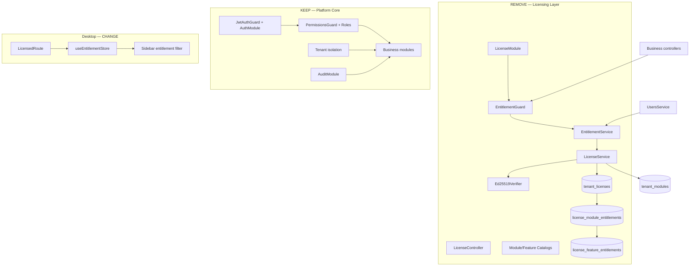

# Fratelanza Business Platform — Product Reset Audit

**Date:** 2026-09-08  
**Status:** Steps **1–4 complete** (audit, licensing removal, eval DB `fratelanza_eval`, 3-tenant demo seed). Steps **5–22 in progress** — UX, onboarding, tests, and commercial polish. See `docs/PRODUCT_RESET_COMPLETE.md`.  
**Purpose:** Map every licensing dependency before the product reset described in the commercial productization brief.

---

## Executive Summary

Fratelanza Grand ERP is technically capable but commercially obscured by a **parallel authorization layer**: commercial licensing sits beside RBAC and blocks module access even when code is implemented and users have permissions.

The reset goal is:

| Keep | Remove |
|------|--------|
| Authentication (JWT) | Ed25519 license verification |
| Users, roles, permissions (RBAC) | EntitlementGuard / module gating |
| Tenant isolation | License activation API |
| Audit logging | License expiry / grace / suspend |
| All implemented business modules (open access) | License UI, diagnostics, config requirements |
| LAN/server install model | `mg.fratelanza.com` runtime dependency (none exists today) |

**Verdict before reset:** The product behaves like a licensed SDK demo, not a sellable business platform. This audit defines what must change.

---

## 1. Database Inventory

### 1.1 Licensing tables (candidates for removal)

| Table | Prisma model | Purpose |
|-------|--------------|---------|
| `tenant_licenses` | `TenantLicense` | License record: key, edition, status, limits, `installationId`, signature |
| `license_module_entitlements` | `LicenseModuleEntitlement` | Per-tenant module on/off + term |
| `license_feature_entitlements` | `LicenseFeatureEntitlement` | Per-tenant feature on/off |

**Schema:** `packages/database/prisma/schema.server.prisma`  
**Migrations:**
- `20250907190000_commercial_licensing`
- `20250907200000_license_hardening`

**Enums to drop with licensing:** `LicenseStatus`, `LicenseType`, `EntitlementTermType`, `LicenseEdition`

### 1.2 Legacy / related tables (decision required)

| Table | Prisma model | Notes |
|-------|--------------|-------|
| `tenant_modules` | `TenantModule` | Pre-licensing module flags; **still seeded** and exposed via settings; written by `LicenseService.syncTenantModules()` |

**Recommendation:** After licensing removal, either drop `tenant_modules` or repurpose as optional “enabled modules” admin toggles **without crypto**. For evaluation build, simplest path is **drop gating entirely** — all modules available; RBAC controls access.

### 1.3 RBAC / core tables (must remain)

| Table | Purpose |
|-------|---------|
| `tenants` | Multi-tenant isolation |
| `users`, `roles`, `permissions`, `role_permissions` | RBAC |
| `sessions`, `devices` | Auth |
| `audit_logs` | Compliance |
| All business tables | Products, sales, construction, etc. |

### 1.4 Permissions tied to licensing (remove from seed)

Seed creates RBAC permissions:

- `core:license:read`
- `core:license:manage`

These can be removed after licensing UI/API removal.

---

## 2. Current Database Targets (DO NOT RESET YET)

| Environment | Database | Source | Safe to reset? |
|-------------|----------|--------|----------------|
| **Local dev / evaluation** | `postgresql://…/fratelanza_erp` | `.env` `DATABASE_URL` | **Likely yes** — dev seed + test pollution; **no evidence of real customer data** |
| **Integration tests** | Same `fratelanza_erp` via `.env` | `apps/api/test/setup-env.ts` | Shares dev DB — **major pollution source** |
| **Desktop local** | SQLite `fratelanza-local.db` | `LOCAL_DATABASE_URL` | Safe to reset separately |
| **Staging backups** | `staging-backups/` artifacts | Backup scripts | **Do not delete** — may be needed for restore verification |
| **Production / customer** | Unknown | Not configured in repo | **STOP before any destructive op** if customer DB is pointed at same URL |

### ⚠️ Critical gate (Step 3)

Before any `DELETE`, `db:reset`, or table drop:

1. Confirm `.env` `DATABASE_URL` is **not** a live customer database.
2. Prefer creating a **new database** `fratelanza_eval` for the clean demo dataset.
3. Document which DB was reset in `PRODUCT_RESET_COMPLETE.md`.

**Current local target:** `fratelanza_erp` on `localhost:5432` — appears to be **development only**, but contains heavy test pollution (duplicate roles like “Foundation Only”, auto-generated users).

---

## 3. API Architecture

### 3.1 Request pipeline (today)

```
HTTP Request
  → JwtAuthGuard (global)           — identity
  → ThrottlerGuard (global)
  → EntitlementGuard (global)       — LICENSE: module/feature
  → PermissionsGuard (per route)    — RBAC: user permission
  → Controller handler
```

**After reset:**

```
HTTP Request
  → JwtAuthGuard
  → ThrottlerGuard
  → PermissionsGuard                — RBAC only
  → Controller handler
```

### 3.2 License module (`apps/api/src/modules/license/`)

| File | Role | Reset action |
|------|------|--------------|
| `license.module.ts` | Registers `EntitlementGuard` as `APP_GUARD` | **Remove module** |
| `license.controller.ts` | `/license/*` routes | **Remove** |
| `license.service.ts` | Activation, integrity, limits, seedDemoLicense | **Remove** |
| `entitlement.service.ts` | requireModule, requireFeature, assertLimit | **Remove** (move limit policy elsewhere or drop) |
| `guards/entitlement.guard.ts` | Global license guard | **Remove** |
| `catalog/*` | Module/feature/edition catalogs | **Remove** or move module list to nav-only config |
| `verification/*` | Ed25519, canonical document, activation | **Remove entirely** |
| `dto/*` | activate-license, set-module-enabled | **Remove** |

### 3.3 Decorators (`apps/api/src/common/decorators/index.ts`)

| Decorator | Reset action |
|-----------|--------------|
| `@RequireModule()` | **Remove** from all controllers |
| `@RequireFeature()` | **Remove** from all controllers |
| `@LicenseExempt()` | **Remove** (no longer needed) |
| `@RequirePermissions()` | **Keep** |
| `@Public()`, `@TenantId()`, `@CurrentUser()` | **Keep** |

### 3.4 Controllers with `@RequireModule` / `@RequireFeature`

**31 controller files** gate business routes, including:

- `products`, `customers`, `suppliers`, `warehouses`, `inventory`
- `sales`, `purchasing`, `accounting`, `pos`, `sync`
- `finance`, `parties`, `projects`, `cost-centers`
- **12 construction controllers** (contracts, BOQ, progress, billing, costing, etc.)
- `pms/patients`

**Reset:** Strip license decorators; keep `@RequirePermissions` only.

### 3.5 Services with license limits

| Service | Call | Reset action |
|---------|------|--------------|
| `UsersService.create` | `entitlementService.assertLimit('maxUsers')` | Remove or replace with static config |
| `BranchesService.create` | `entitlementService.assertLimit('maxBranches')` | Same |
| `SystemService.getDiagnostics` | Embeds license + entitlements + `installationId` | Remove license block |

### 3.6 License-exempt core controllers (unchanged scope)

These remain reachable without license today — keep as RBAC-only:

- `auth`, `dashboard`, `settings`, `tenants`
- `users`, `roles`, `branches`, `devices`, `audit`
- `system` (diagnostics — simplify)
- `license` — **delete entire controller**

### 3.7 App module

`apps/api/src/app.module.ts` imports `LicenseModule` — **remove import and registration**.

---

## 4. Configuration

### 4.1 Environment variables (licensing-related)

| Variable | Current role | Reset action |
|----------|--------------|--------------|
| `LICENSE_VERIFICATION_PUBLIC_KEY` | Required in production bootstrap | **Remove requirement** |
| `LICENSE_SIGNING_PRIVATE_KEY` | Dev/test signing | **Remove** |
| `LICENSE_ALLOW_UNSIGNED_DEV` | Dev bypass | **Remove** |
| `FRATELANZA_INSTALLATION_ID` | Server binding on activation | **Remove requirement** |

**File:** `packages/config/src/index.ts` — `LicenseConfig`, `validateAppConfig()` production rules.

**After reset:** App must start with normal `.env` (DB + JWT only).

### 4.2 External dependencies

| Reference | Runtime? | Action |
|-----------|----------|--------|
| `mg.fratelanza.com` | **No** — docs/comments only | Remove from docs/examples |
| License server | **No** | N/A |
| Online activation | **No** (offline Ed25519) | Remove verification path |

---

## 5. Desktop Application

### 5.1 Entitlement gating (remove)

| File | Behavior | Reset action |
|------|----------|--------------|
| `stores/index.ts` | `useEntitlementStore` | **Remove store** |
| `components/AppLayout.tsx` | Fetches `/license/entitlements`, filters sidebar | **Show all implemented nav items** (RBAC can filter later) |
| `components/AuthGate.tsx` | `LicensedRoute` blocks unlicensed modules | **Remove** — use auth-only route guard |
| `App.tsx` | Routes wrapped in `LicensedRoute` | Plain routes |
| `pages/SettingsPage.tsx` | Module access / enable-all UI | **Remove license section** |
| `components/PageState.tsx` | `unlicensed` variant | **Remove** |
| `lib/api.ts` | License API methods | **Remove** |
| `packages/localization` | `license.*` strings | **Remove** or repurpose |

### 5.2 Navigation map

`AppLayout.tsx` uses `NAV_MODULE_MAP` to hide sidebar items by entitlement.

**After reset:** Sidebar shows all implemented modules; optional future: hide by RBAC permission keys matching nav items.

---

## 6. Seed & Demo Data

### 6.1 Current seed (`packages/database/prisma/seed.ts`)

| Function | Purpose | Reset action |
|----------|---------|--------------|
| `seedTenantLicense()` | Creates `TenantLicense` + module/feature entitlements | **Remove** |
| `tenant_modules` upserts | Legacy module flags | **Remove or simplify** |
| Single tenant “Fratelanza Demo Company” | Default tenant | **Replace** with 3 intentional demo businesses |
| `admin@fratelanza.local` | Admin user | **Replace** with documented eval credentials (not in source) |

### 6.2 Test pollution (observed)

Integration tests create junk in **shared dev DB**:

- Roles named “Foundation Only”, “Foundation Only Mat” (construction test fixtures)
- Users like `billing-*@fratelanza.local`, `only-*@fratelanza.local`
- Hundreds of duplicate role records

**Root cause:** Tests use same `DATABASE_URL` as dev; `prisma.role.create()` in specs without cleanup.

**Reset actions (Step 3–4):**

1. Separate test DB **or** transactional test isolation
2. `scripts/clean-dev-junk.ts` (interim) — not sufficient alone
3. New `scripts/seed-demo-data.*` with 3 tenants only

---

## 7. Test Infrastructure

### 7.1 Remove entirely

| File | Reason |
|------|--------|
| `apps/api/test/licensing.integration.spec.ts` | Licensing-only |
| `apps/api/test/license-hardening.integration.spec.ts` | Ed25519 / tamper |
| `apps/api/test/license-test.helpers.ts` | Signing helpers |

### 7.2 Gut or rewrite

| File | Change |
|------|--------|
| `apps/api/test/production-config.spec.ts` | Remove LICENSE_* / installationId tests |
| `apps/api/test/commercial-deployment.integration.spec.ts` | Remove license-specific cases |
| `apps/api/test/setup-env.ts` | Remove Ed25519 key generation |

### 7.3 Update (remove license bootstrap)

| File | Current dependency |
|------|-------------------|
| `apps/api/test/test-app.ts` | `seedDemoLicense()`, `ensureLicense()` |
| `apps/api/test/construction-test.helpers.ts` | `activateConstructionLicense()` |
| 11× `construction-*.integration.spec.ts` | Construction license activation |
| `inventory`, `sales`, `purchasing`, `projects`, `resilience` specs | `seedDemoLicense()` |

**New test baseline:** `createTestApp()` seeds tenant + RBAC only; all modules implicitly available.

---

## 8. Scripts & Artifacts (obsolete after reset)

| Path | Action |
|------|--------|
| `scripts/staging-resign-license.ts` | **Remove** |
| `scripts/staging-env-check.ts` (license checks) | **Update** — drop license section |
| `.env.staging-license` | **Remove from normal dev** (gitignored secret) |
| `scripts/Start-Fratelanza-API.bat` | Stop loading `.env.staging-license` |
| `Enable-All-Modules.cmd` | **Remove** after licensing gone |
| `3-Clean-Test-Data.cmd` | Replace with proper eval reset script |

**Do not delete:** `scripts/backup-database.ps1`, `staging-backups/` customer backup artifacts.

---

## 9. Documentation (licensing-era)

Archive or supersede — do not delete history without replacement:

- `docs/PHASE_4_5_LICENSING_*`
- `docs/PHASE_4_5_1_LICENSE_HARDENING_COMPLETE.md`
- Phase 10 staging docs referencing license regression

**New docs planned by reset brief:**

| Document | Step |
|----------|------|
| `PRODUCT_RESET_AUDIT.md` | **1 — this file** |
| `FIELD_DEFINITION_AUDIT.md` | 7 |
| `FRATELANZA_BUSINESS_GLOSSARY.md` | 15 |
| `COMMERCIAL_PRODUCT_REVIEW.md` | 20 |
| `PRODUCT_DEMO_CHECKLIST.md` | 21 |
| `PRODUCT_RESET_COMPLETE.md` | Final |

---

## 10. Dependency Graph



---

## 11. Removal Sequence (recommended — Steps 2+)

Execute **only after** database target is confirmed safe.

| Phase | Work | Risk |
|-------|------|------|
| **2a** | Remove `EntitlementGuard`, `@RequireModule`/`@RequireFeature`, `LicenseModule` | Medium — 31 controllers |
| **2b** | Remove license routes, services, verification code | Low |
| **2c** | Remove desktop entitlement store, `LicensedRoute`, settings license UI | Medium — UX |
| **2d** | Simplify `packages/config` — no LICENSE_* required | High — deployment contract |
| **3** | DB migration: drop license tables; reset eval DB | **High — destructive** |
| **4** | New demo seed: 3 tenants, intentional data | Medium |
| **5–15** | UX, forms, onboarding, glossary | Product work |
| **17** | Test suite update | High — many files |
| **19** | Remove staging license artifacts | Low |

---

## 12. RBAC Retention Plan

Licensing removal **does not** remove authorization.

| Scenario | Behavior after reset |
|----------|---------------------|
| User without `sales:invoices:read` opens Sales | **403** — “ليس لديك صلاحية…” |
| Authenticated admin with full permissions | **All modules available** |
| Unauthenticated request | **401** |
| Cross-tenant data access | **Blocked** by tenant scoping |

Optional enhancement (post-reset): filter desktop sidebar by `user.permissions` instead of entitlements.

---

## 13. What “All Modules Available” Means

For the **evaluation build**, every implemented API module should respond when the user has RBAC permission:

- Core, Finance, Party, Products, Customers, Suppliers, Warehouses, Inventory
- Sales, Purchasing, Accounting, POS, Sync
- Projects, Cost Centers
- Construction (full vertical)
- PMS (if kept)

Modules without desktop UI remain API-only — navigation audit (Step 11) must not invent fake screens.

---

## 14. Open Questions Before Step 2

1. **Separate eval database name?** Recommend `fratelanza_eval` vs wiping `fratelanza_erp`.
2. **Keep `tenant_modules` table?** Recommend drop with licensing unless product wants admin module toggles without crypto.
3. **User/branch limits?** Remove entirely for evaluation, or soft limits in config?
4. **PMS module** — include in demo tenants or exclude as non-core?
5. **Construction desktop routes** — several exist; many construction sub-screens are API-only — document in demo checklist.

---

## 15. Audit Completion Checklist

- [x] Database models inventoried
- [x] Guards and decorators mapped
- [x] Services and controllers listed
- [x] Config and env vars documented
- [x] Desktop gating mapped
- [x] Seed and pollution sources identified
- [x] Test files classified (remove vs update)
- [x] `mg.fratelanza.com` confirmed non-runtime
- [x] RBAC dependencies separated from licensing
- [x] Database safety gate documented
- [x] Removal sequence proposed
- [x] **Steps 2–4 complete** — licensing removed; eval DB seeded
- [ ] **Steps 5–22 ongoing** — forms, onboarding, navigation, tests, commercial polish

---

## 16. Current Status & Next Actions

**Completed (Steps 1–4):**

1. This audit (`PRODUCT_RESET_AUDIT.md`)
2. Licensing architecture removed from API, config, and desktop
3. Evaluation database **`fratelanza_eval`** — never use for real customer data
4. Demo seed: `TRADING_DEMO`, `CONSTRUCTION_DEMO`, `SERVICES_DEMO`

**Documentation added (Steps 7, 15, 18–21):**

- `FIELD_DEFINITION_AUDIT.md`, `FRATELANZA_BUSINESS_GLOSSARY.md`
- `COMMERCIAL_PRODUCT_REVIEW.md`, `PRODUCT_DEMO_CHECKLIST.md`
- `SEED_ARCHITECTURE.md`, `PRODUCT_RESET_COMPLETE.md`, `DEMO_CREDENTIALS.md`

**Active work (Steps 5–6, 8–14, 16–17, 19, 22–23):**

- Form UX, onboarding, dashboard, empty states, error messages
- Test suite stabilization on `fratelanza_eval`
- Remove PMS/clinic from ERP demo scope; construction desktop nav gaps
- Verdict remains **B)** — see `COMMERCIAL_PRODUCT_REVIEW.md`

**Do not run destructive operations on `fratelanza_erp` without confirming it is not a customer database.**

---

*Step 1 audit complete. Steps 2–4 executed. Product reset documentation and Steps 5–22 tracked in `PRODUCT_RESET_COMPLETE.md`.*
